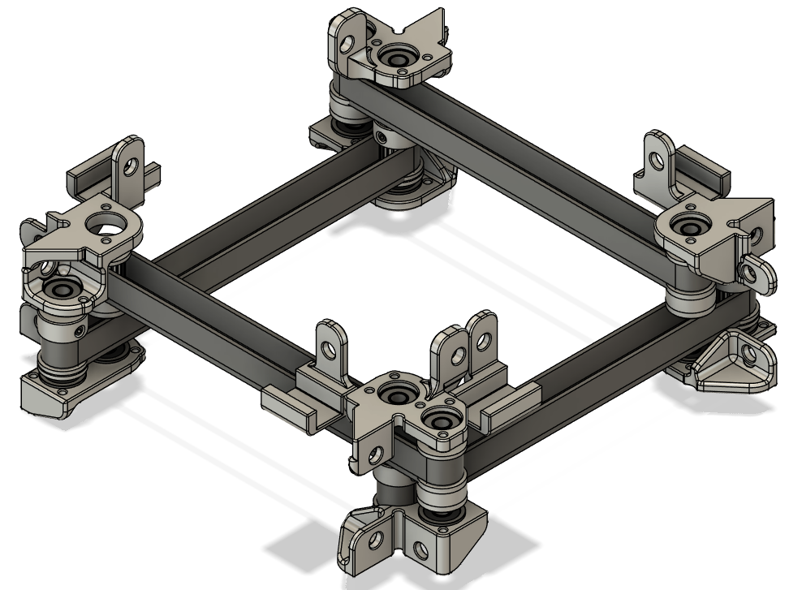
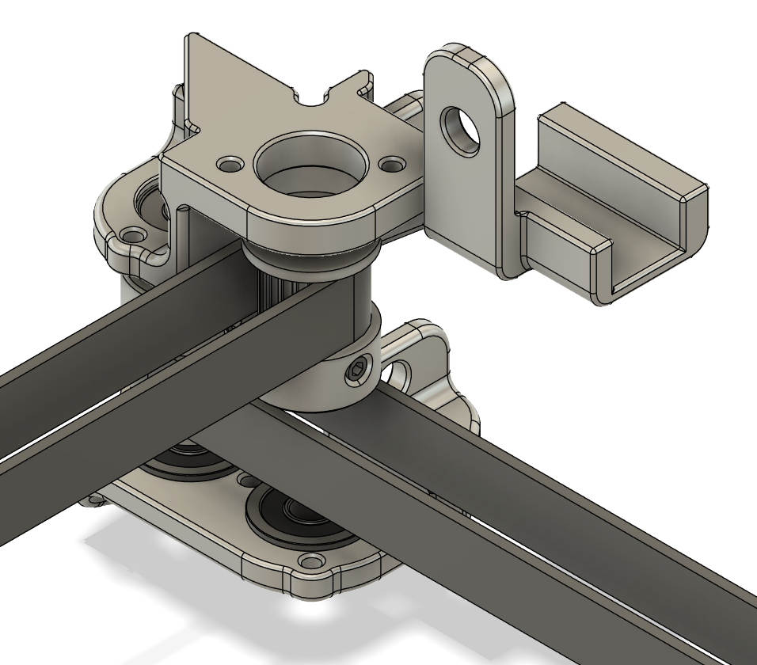
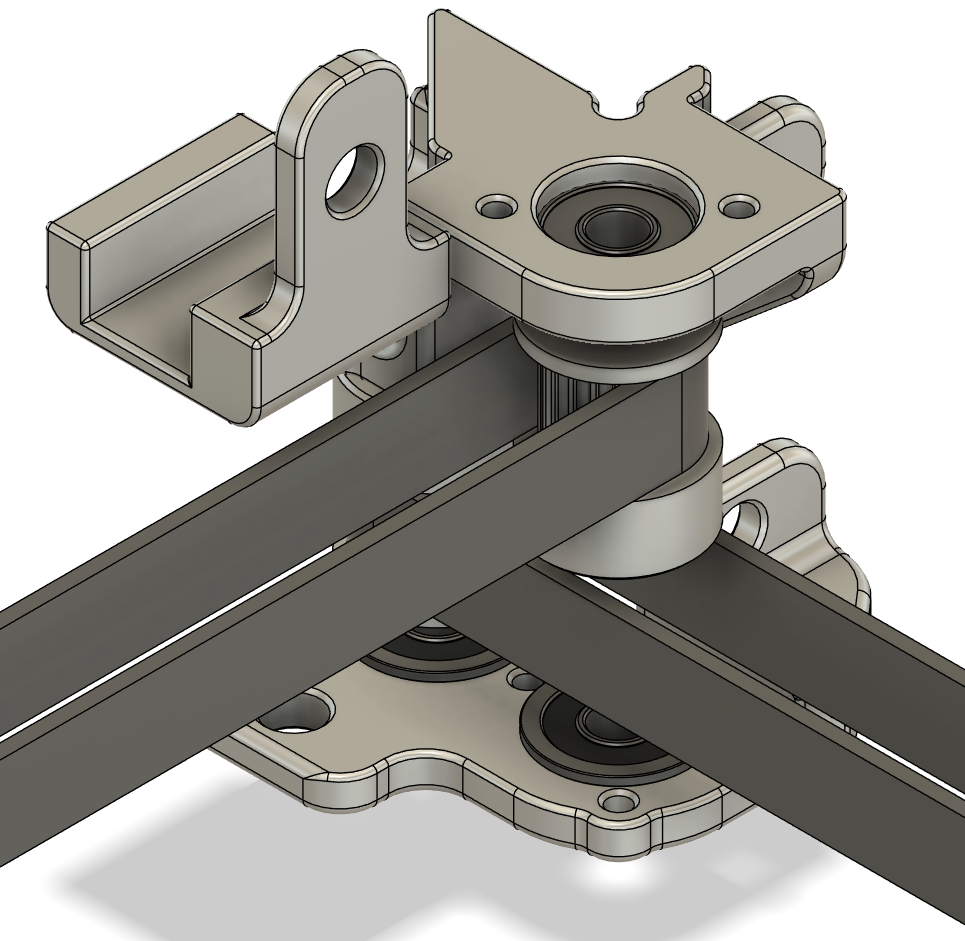
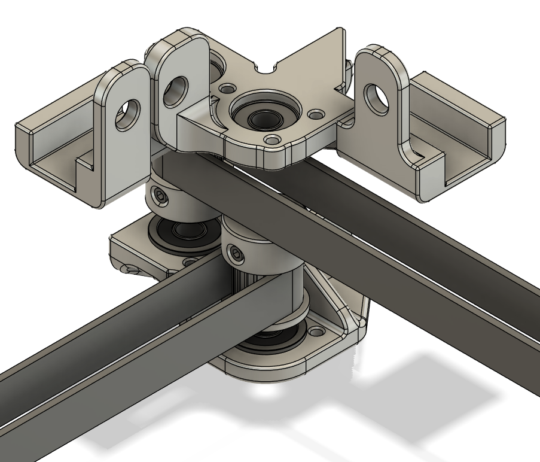

# SLM Printable XY Idlers for the Annex Engineering K3
These drives are designed to be SLM printed in aluminum (or other metals for $$$).  They allow for the toothed idlers to be changed to a full sized pulley with double shear.  Full sized bearings can take a lot more load than the smaller toothed idler bearings.  This should allow for full tension GT3 belts.

## Important Note

All bearings have been swapped to F695 (5mm shaft) or MF148 (8mm shaft).

The bearing holes are intentionally undersized.  In order to get a snug fit, you will need to first drill and then ream the holes to size.  All bearing locations have holes for M3 bolts for retention.  It is recommended to use M3x4 or M3x5 Button Head Cap Screws (BHCS).  There are 16 bearing locations and each will need 2-3 retaining bolts.  Retaining compound can also be used, but may make bearing removal difficult to impossible depending on the breakdown temperature of the compound used. 

The endstops have been modeled together as one part to reduce print costs, the number of files, and to ensure they are matching heights.  The finished parts will need to be cut apart and sanded flat.  Only sand where the connecting nubs are present to avoid altering the overall length of the parts. 

### Approximate part weights
- MP_DooKi3_SLM_XY_V6_XDrive_Top: 18.1g
- MP_DooKi3_SLM_XY_V6_XDrive_BottomFront: 13.6g
- MP_DooKi3_SLM_XY_V6_XDrive_BottomRear: 13.1g
- MP_DooKi3_SLM_XY_V6_YDrive_Top: 15.6g
- MP_DooKi3_SLM_XY_V6_YDrive_Bottom: 17.5g
- MP_DooKi3_SLM_XY_V6_Endstops: 35g

## BOM
These lists are the recommended configurations for each belt setup.
### 9 or 10mm GT2 or GT3 belts
In addition to the stock four GT2 9mm pulleys you will need:
- 16 - F695 bearings for 5mm shafts
- 4 - additional GT2 9mm Pulleys with 5mm bore
- 4 - 37mm D cut 5mm diameter shafts (for the idler pulley)

### 12mm GT2 belts

IF YOU USE 12MM BELTS THE FOUR PULLEYS USED FOR THE DRIVE (MOTOR) SHAFTS WILL NEED APPROXIMATELY 1-2MM GROUND OFF THE BOTTOM (SET SCREW END) IN ORDER TO AVOID INTERFERENCE WITH THE BELTS.

In addition to the stock four GT2 9mm pulleys you will need:
- 16 - F695 bearings for 5mm shafts
- 4 - additional GT2 9mm pulleys with 5mm bore
- 4 - 37mm D cut 5mm diameter shafts (for the idler pulley)

### 12mm GT3 belts

IF YOU USE 12MM BELTS THE FOUR PULLEYS USED FOR THE DRIVE (MOTOR) SHAFTS WILL NEED APPROXIMATELY 1-2MM GROUND OFF THE BOTTOM (SET SCREW END) IN ORDER TO AVOID INTERFERENCE WITH THE BELTS.

You will need:
- 16 - MF148 bearings for 8mm shafts
- 8 - additional GT2 12mm pulleys with 8mm bore.
- 4 - 37mm D cut 8mm diameter shafts (for the idler pulley)
- 4 - 60mm D cut 8mm diameter shafts (for drive pulley)
- 4 - Couplers to attach the motor, see Annex BOM for recommendations

## Updates
### 2024-08-07
- Reorganized the outdated parts folder and added version numbers for better tracking.
  - V1 are the original files
  - V2 have updated clearances and should be slightly lighter
- Updated XY idlers to V3 to allow for better clearances.
  - V3 will need the left Y rail shifted 10.5mm towards the front of the machine and the right Y rail shifted 10.5mm towards the rear of the machine.  This will allow for the idler stacks to be more easily removeable like the current Annex Engineering K3 625 bearing mounts.  All of the mounting bolts are oriented to thread into T-nuts in the vertical extrusions so shorter than standard allen wrenches are no longer needed.

 ### 2024-08-20
  - Updated parts to V6
    - Converted to two part idlers instead of single part.  This should make them easier to print and post process (drill ream).
    - All parts now have holes where button-head cap screws (BHCS) can be used to retain the bearings.
    - The endstops have been combined into one printable file.
    - There are two lower parts for the X drives. One for the front left drive and one for the rear right drive. 

## Images
### XY Assembly:

### X Drive:

### Y Drive:

