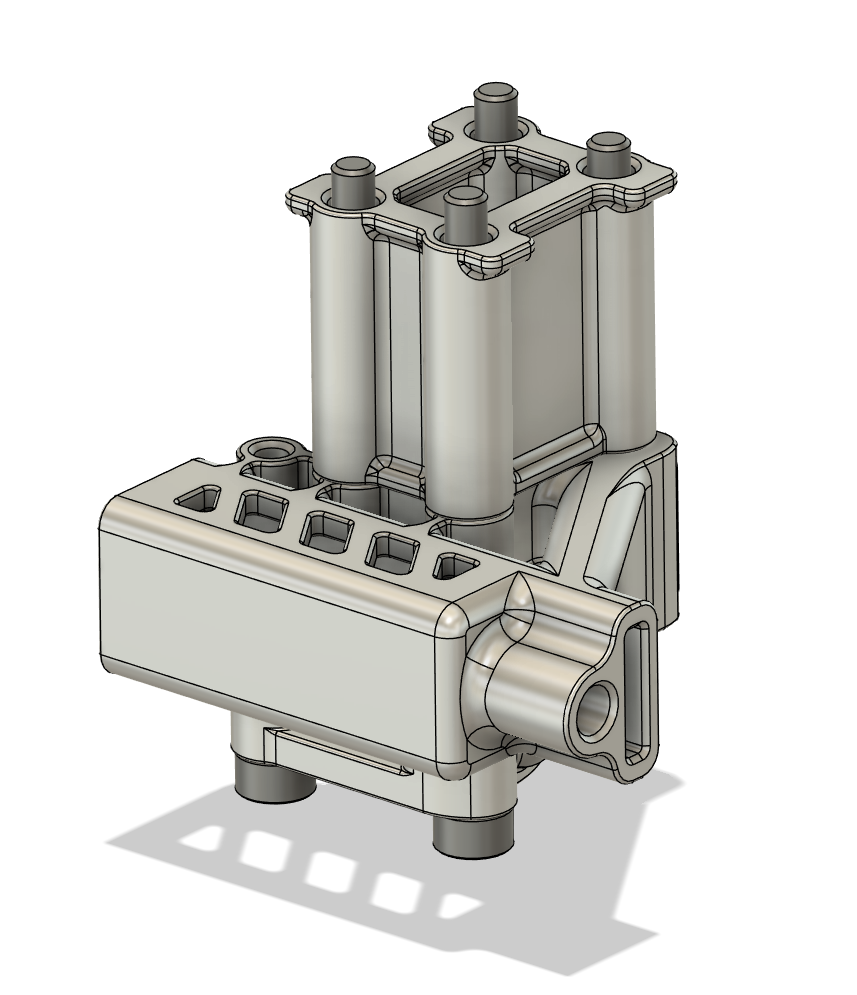

# SLM XY Tensioner Stack for the Z Axis of DooKi3 or Annex Engineering K3
These files are designed to be SLM printed out of aluminum.

## Notes
The Y Spacers are modeled as 20mm tall.  It would most likely be a good idea to stretch these parts slightly taller to account for SLM shrinkage.  They will need sanded to the correct dimensions based on the rails and toolhead used for the machine.

The rail carriage mount only uses three bolts.  This allows the tensioner to remain installed with two bolts while the cross rails are removed so belt tension can be preserved during maintenance. 

These should be the approximate weights for these parts in aluminum:
- MP_DooKi3_SLM_XY_Tensioner_V3: 12.5g
- MP_DooKi3_SLM_XY_Rail_Mount_V2: 3.9g
- MP_DooKi3_SLM_Y_Spacer_V2: 6.2g

Total:
- X total: 16.4g per side
- Y total: 22.6g per side

## Updates
### 2024-08-07
- Reorganized the outdated parts folder and added version numbers for better tracking.
  - V1 are the original files
  - V2 have updated clearances and should be slightly lighter
- Updated XY tensioners to V3 to allow for the use of up to 10mm wide belts.
  - This version is also compatible with 9mm belts and is recommended for all belt thicknesses.
  - This version will require the use of the 10mm versions of the tensioning sliders.

## Images

