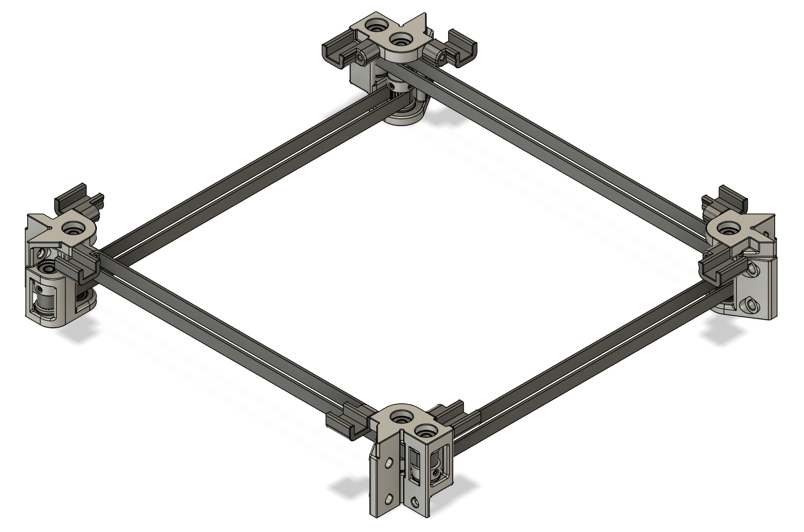
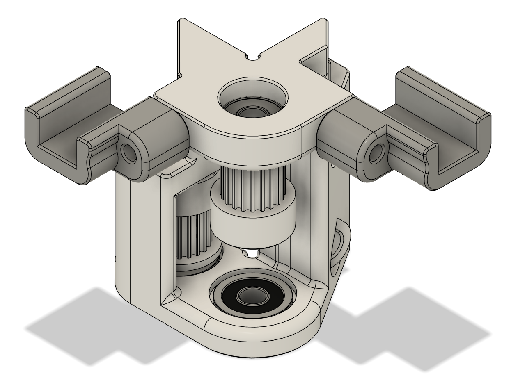
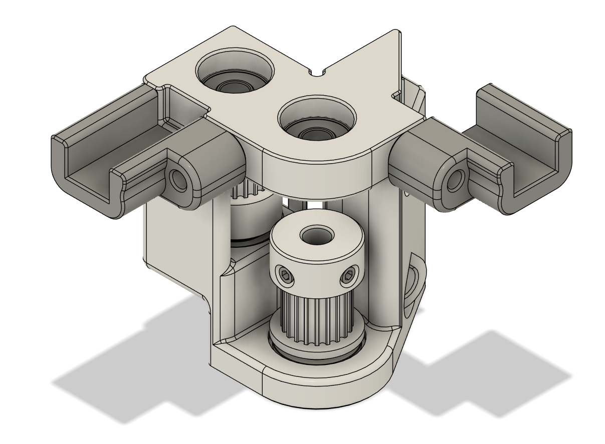
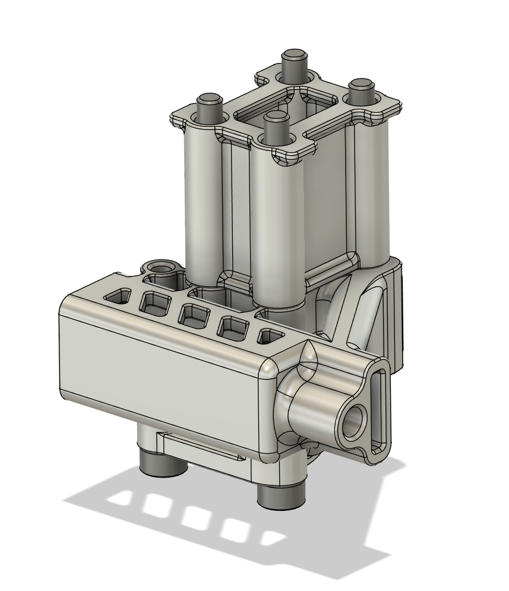
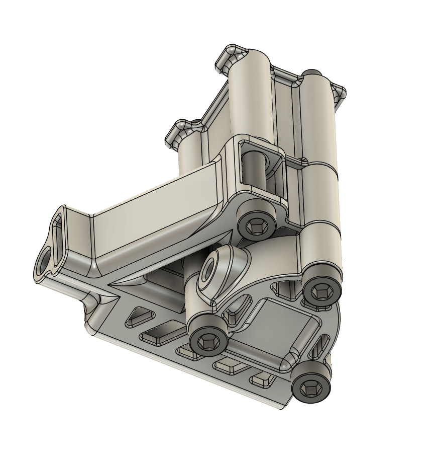
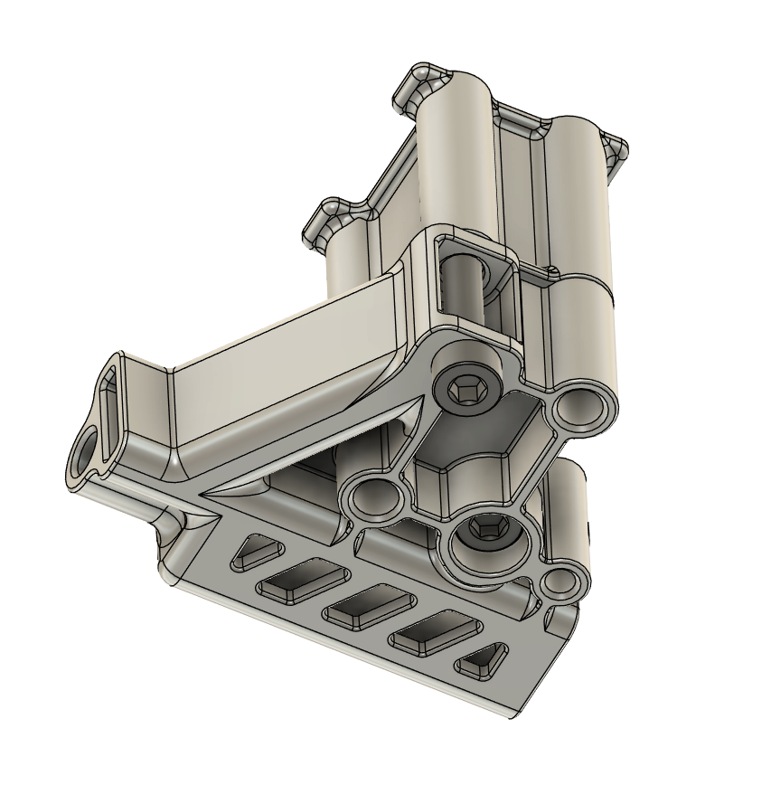
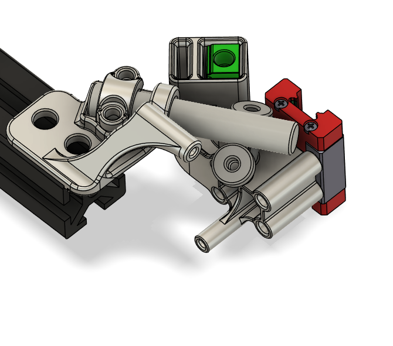

# SLM parts for the X, Y, and Z Axis of DooKi3 or Annex Engineering K3
These files are designed to be SLM printed out of aluminum.

### Please read all the notes in the READMEs for any parts you plan to order.

## Notes
There are four versions of the tensioning slider.  At this time it is recommended to get the thickest version (+0.15) and sand to size.

## SLM XY Idlers - Live shafts and full sized pulleys:

## SLM XY Tensioners

## SLM Z Maxwell Mounts and MGN9C Carriages

