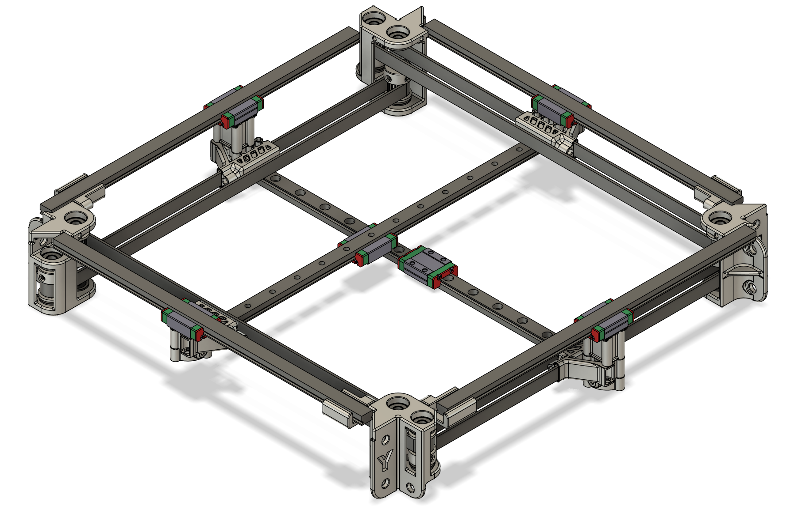
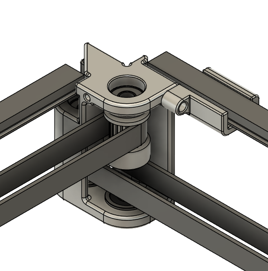
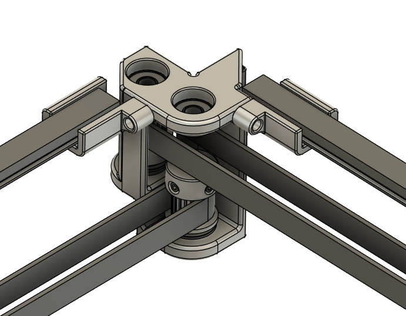

# SLM parts for the X, Y, and Z Axis of DooKi3 or Annex Engineering K3
These files are designed to be SLM printed out of aluminum.  All files in this repo are still a WIP.  Do not order parts unless you are prepared for post-processing ill-fitting parts or worst-case scraping a whole batch of parts.

### !!! Please read all the notes in the READMEs for any parts you plan to order. !!!

## Notes
There are a few different versions of the tensioning slider with different clearances.  At this time it is recommended to get the thickest version (+0.15) and sand to size. The machine will need a minimum of 7 tensioning sliders (4 for XY and 3 for Z).  As of August 7th 2024 the XY and Z tensioners have been updated to V3 and allow for the use of 10mm belts.  This is the version that is recommended even for 9mm belts and requires the slightly wider tensioning sliders.

## SLM XY Idlers - Live shafts and full sized pulleys:

## SLM XY Tensioners

## SLM Z Maxwell Mounts and MGN9C Carriages

