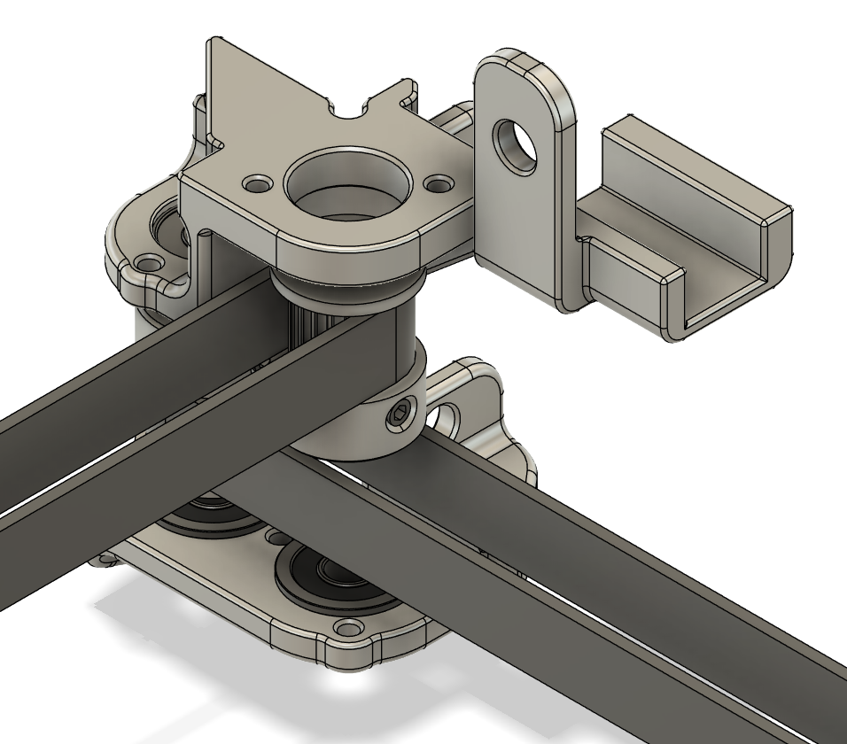

# SLM parts for the X, Y, and Z Axis of DooKi3 or Annex Engineering K3
These files are designed to be SLM printed out of aluminum.  All files in this repo are still a WIP.  Do not order parts unless you are prepared for post-processing ill-fitting parts or worst-case scraping a whole batch of parts.

### !!! Please read all the notes in the READMEs for any parts you plan to order. !!!

## Notes
There are a few different versions of the tensioning slider with different clearances.  At this time it is recommended to get the thickest version (+0.15) and sand to size. The machine will need a minimum of 7 tensioning sliders (4 for XY and 3 for Z).  As of August 20th 2024 the Z tensioners have been updated to V3 to allow for the use of up to 10mm belts and the XY tensioners have been updated to V4 to allow for the use of either 9/10mm belts or 12mm belts.  This 10mm version is recommended even for 9mm belts and requires the 10mm tensioning sliders. 9/10mm belts will also work with the 12mm parts, but they will be slightly heavier and won't have any othewr benefits besides allowing the use of 12mm belt.

## SLM XY Idlers - Live shafts and full sized pulleys:

## SLM XY Tensioners

## SLM Z Maxwell Mounts and MGN9C Carriages

